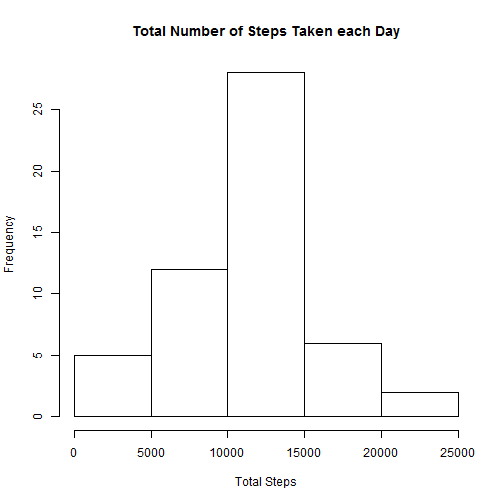
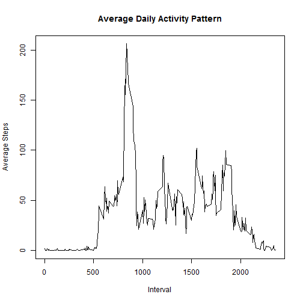
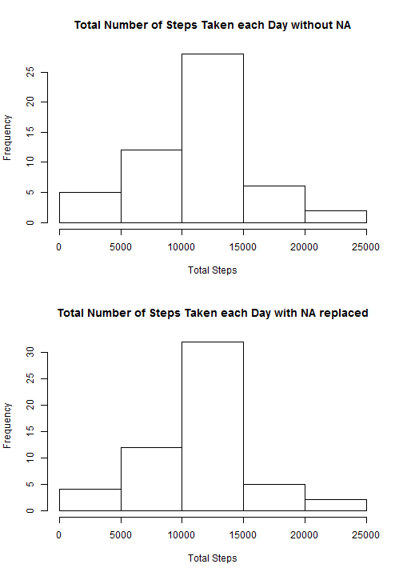
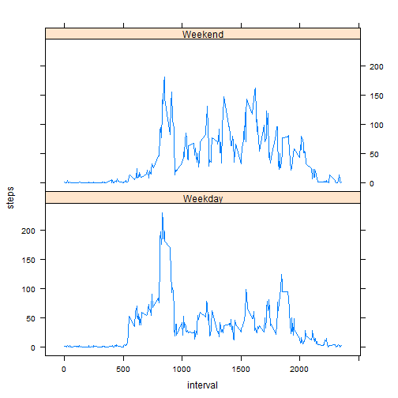

## Loading and preprocessing the data
Unzip file(assuming zip file exists at the same directory as this markdown) and overwrite extracted content  
Then preprocess date, change class from factor to date

```r
zipfile <- "activity.zip"
unzip(zipfile, overwrite = TRUE)
activity <- read.csv("activity.csv")
activity$date <- as.POSIXct(activity$date)
```


## What is mean total number of steps taken per day?
Calculating sum of steps per day ignoring NA value and plot a histogram of it

```r
sumStepsDay <- aggregate(steps ~ date, data = activity, FUN=sum, na.rm = TRUE)
names(sumStepsDay) <- c("date","steps")
title <- "Total Number of Steps Taken each Day"
hist(sumStepsDay$steps, main = title, xlab="Total Steps")
```

 
  
The mean and median are calculated with this

```r
meanSteps <- mean(sumStepsDay$steps)
print(meanSteps)
```

```
## [1] 10766.19
```

```r
medianSteps <- median(sumStepsDay$steps)
print(medianSteps)
```

```
## [1] 10765
```
The mean of total number of steps taken per day is **10766.19**  
The median of total number of steps taken per day is **10765**

## What is the average daily activity pattern?
5-minute interval and average number of steps taken, averaged accross all days can be compute with  

```r
sumStepsInterval <- aggregate(steps ~ interval, data = activity, FUN=mean, na.rm=TRUE)
title2<-"Average Daily Activity Pattern"
plot(sumStepsInterval, type="l", main=title2, xlab="Interval",ylab="Average Steps")
```

 
  
Maximum number of steps of the intervals can be calculate with

```r
maxInterval <- sumStepsInterval[which.max(sumStepsInterval$steps),"interval"]
print(maxInterval)
```

```
## [1] 835
```
So the interval for maximum number of steps is at **835**

## Imputing missing values
Total number of missing values can be find with

```r
totalNA <- sum(is.na(activity$steps))
print(totalNA)
```

```
## [1] 2304
```
As can be seen, the total number of missing values is **2304**  
Now, the missing values need to be fill with a value, which can be filled using mean of that day

```r
filledActivity <- activity
src <- sumStepsInterval
NAIndex <- which(is.na(filledActivity$steps))
for (i in seq_along(NAIndex)){
        filledActivity[i,]$steps <- src[src$interval==filledActivity[i,]$interval,]$steps
}
title3 <- "Total Number of Steps Taken each Day without NA"
title4 <- "Total Number of Steps Taken each Day with NA replaced"
sumFillStepsDay <- aggregate(steps ~ date, data = filledActivity, FUN=sum)
names(sumFillStepsDay) <- c("date","steps")
par(mfrow=c(2,1))
hist(sumStepsDay$steps, main = title3, xlab="Total Steps")
hist(sumFillStepsDay$steps, main = title4, xlab="Total Steps")
```

 
At first, you can see that there is not much different between with NA and without NA's figure, but if you look closely there are several differences. These also shown when comparing the mean and median values.

```r
filledMeanSteps <- mean(sumFillStepsDay$steps)
print(filledMeanSteps)
```

```
## [1] 10789.35
```

```r
filledMedianSteps <- median(sumFillStepsDay$steps)
print(filledMedianSteps)
```

```
## [1] 10766.19
```
The impact of imputing missing values make mean increased from 10766.19 to 10789.35  
The impact of imputing missing values make median increased from 10765.00 to 10766.19  

## Are there differences in activity patterns between weekdays and weekends?
There are differences between weekdays and weekends activity patterns, and that can be shown by


```r
library(lattice)
filledActivity$dayType <- ifelse(weekdays(filledActivity$date) %in% c("Saturday","Sunday"), "Weekend","Weekday")
plotData <- aggregate(steps ~ interval + dayType, data = filledActivity, mean)
xyplot(steps ~ interval | dayType, data = plotData, layout = c(1,2), type = "l")
```

 
